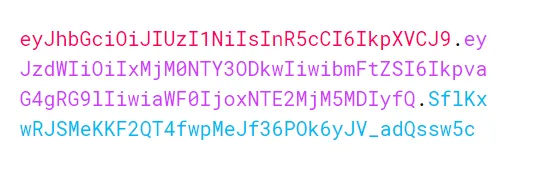

 

___

# 🔐 JSON Web Tokens (JWT)

## 📌 What is JWT?

When developing web applications, **user authentication and authorization** are critical for security. To protect our applications from unauthorized users and allow access only to authorized ones, we use various methods — **JWT (JSON Web Tokens)** is one of the most effective solutions at this point.

---

## ✅ Why JWT?

JWT offers several advantages over its alternatives:

- **Compact Structure**  
  Unlike XML-based alternatives, JWT uses JSON, making it much more lightweight and easier to transfer over HTTP.

- **Easy Parsing**  
  Most programming languages offer native support or libraries for parsing JSON. Developers generally prefer JSON due to its simplicity and ability to easily map into objects within their application code.

- **Cross-Domain Usage**  
  A single JWT can be used across multiple domains for authentication. This makes it highly suitable for **Single Sign-On (SSO)** mechanisms.

---

## 📍 Where is JWT Used?

To put it simply, **JWT is a standard for securely transmitting data between parties as a JSON object**.

It is most commonly used in **user authentication** workflows. Once a user is authenticated, the server generates a token and sends it to the client. The client includes this token in subsequent requests. The server validates the token **locally**, without needing to contact another server or perform a database query. This makes authentication fast and scalable.

Thanks to its small size, a JWT can easily be:

- Sent via URL
- Embedded in POST parameters
- Included in HTTP headers

This makes JWT ideal for modern web applications that require **stateless, fast, and secure** communication between client and server.
___ 

## 🧩 Structure of a JSON Web Token

A JSON Web Token (JWT) consists of **three parts separated by dots (`.`)**: 

 


___ 


---
## 🔴 eyJhbGciOiJIUzI1NiIsInR5cCI6IkpXVCJ9
### 🔷 Header

The **Header** contains metadata about how the token is generated.

It typically includes two fields:

- `alg`: The algorithm used to sign the token (e.g., HS256)
- `typ`: The type of token (usually `"JWT"`)

Example:

```json
{
  "alg": "HS256",
  "typ": "JWT"
}
``` 
Each part is **Base64Url encoded**, and together they form the complete token.

---
## 🟣 eyJzdWIiOiIxMjM0NTY3ODkwIiwibmFtZSI6IkpvaG4gRG9lIiwiaWF0IjoxNTE2MjM5MDIyfQ

### 🟪 2. Payload

The Payload is a JSON object that contains the claims. This is the data part of the token.
It can be customized to include extra information such as user details.
Since this data is readable, sensitive information should not be stored here.

There are three types of claims:

✔️ Registered Claims

### These are predefined claims that are recommended for use. Some of the most common are:
#### • sub: Subject — who the token refers to
#### •	iss: Issuer — who issued and signed the token
#### •	aud: Audience — the intended recipient
#### •	jti: JWT ID — unique identifier for the token
#### •	exp: Expiration time
#### •	iat: Issued at time
#### •	nbf: Not valid before  


___ 

## 🟦 SflKxwRJSMeKKF2QT4fwpMeJf36POk6yJV_adQssw5c

## 🟦 3. Signature

The Signature is generated using the Header, the Payload, and a secret key.
It ensures that the content has not been tampered with and verifies the authenticity of the token.

How the Signature is Created 


___

## 🚀 Advantages of JWT (JSON Web Tokens)

1. **Stateless Authentication**  
   JWTs are **stateless** — there is no session stored on the server or client.  
   All the required information (user identity, token validity, etc.) is stored **within the token itself**.

2. **Portability Across Systems**  
   JWTs are **portable** and can work across multiple backends.  
   They are not limited to use between only two parties.  
   This is especially useful when your **web and mobile apps** consume the same API.

3. **Uses JSON Format**  
   JWTs use **JSON**, a widely accepted, lightweight, and easily parsable format.  
   This makes integration simple across different programming environments.

4. **Faster Authentication**  
   Token verification is faster than traditional session-based authorization methods.  
   There's no need to access a **database** to validate every request.

5. **No Need for Cookies**  
   Since JWTs can be stored in **localStorage** or **sessionStorage**, there's no dependency on cookies.  
   This makes JWT a perfect choice for **mobile applications** as well.  

___  
## 🧱 Architecture

This project follows the architecture below:
## 📌 Main Reference

🎥 [**JWT Authentication Explained – YouTube**](https://www.youtube.com/watch?v=JdnwMpP6YhE)  
___ 
 

___ 

## 🐳 Docker Configuration (PostgreSQL)

This project uses **PostgreSQL** as the database and runs it inside a Docker container using `docker-compose`.

### 🔧 Configuration Overview

```yaml
services:
  db:
    image: postgres:15
    restart: always
    container_name: jwt-postgres-db
    environment:
      POSTGRES_DB: postgres
      POSTGRES_USER: yvz
      POSTGRES_PASSWORD: ozm
    ports:
      - "5433:5432"
    volumes:
      - postgres_data:/var/lib/postgresql/data
      - ./init.sql:/docker-entrypoint-initdb.d/init.sql

volumes:
  postgres_data:
  
  ``` 
___

## 🔚 Conclusion

In this project, three different authentication strategies have been explored and implemented separately:

- 🔐 **Basic Authentication with Auto Configuration**
- 🧠 **In-Memory Authentication**
- 🔑 **JWT (JSON Web Token) Based Authentication**

Each of these approaches is structured and demonstrated in isolation for better understanding and flexibility.

Happy coding and clean architecture! 
## 😊

___ 

## Swagger UI (OpenAPI)

### In this project, the REST APIs are documented using Swagger UI (OpenAPI).
### Secure endpoints can be tested directly through the Swagger interface by providing a valid JWT token.
___ 
####  Accessing the Swagger Interface: 
````aiignore
 http://localhost:8080/swagger-ui/index.html

````

## 🛠️ Technologies & Tools Used 


- ☕ [**JDK 17 or newer**](https://jdk.java.net/17/)  
  Core Java Development Kit used to run and compile the application.

- 🧱 [**Maven**](https://maven.apache.org/)  
  Dependency management and build automation tool.

- 🐘 [**PostgreSQL**](https://www.postgresql.org/)  
  Open-source relational database used to store application data.

- ✨ [**Lombok**](https://projectlombok.org/)  
  Reduces boilerplate code in Java (e.g., getters, setters, constructors).

- 🧩 [**JPA (Java Persistence API)**](https://jakarta.ee/specifications/persistence/)  
  Abstraction layer for database access and ORM.

- 🐳 [**Docker**](https://www.docker.com/)  
  Used to containerize the application and database for consistent deployment.

- 🔐 [**JWT (JSON Web Tokens)**](https://jwt.io/)  
  Secure token-based authentication mechanism used for stateless user sessions.

___

## 📚 Resources & References

- 📘 [JWT (JSON Web Token) Nedir, Nerede Kullanılır? – Medium](https://medium.com/@latestsoftwaredevelopers/jwt-json-web-token-nedir-nerede-kullan%C4%B1l%C4%B1r-67bface90c35)  
  A Turkish-language article explaining what JWT is and where it's used.

- 📘 [Spring Security - JWT Resource Server Documentation](https://docs.spring.io/spring-security/reference/servlet/oauth2/resource-server/jwt.html)  
  Official Spring documentation on how to use JWT in a Spring Security resource server.

- 🎥 [JWT Explained – YouTube](https://www.youtube.com/watch?v=JdnwMpP6YhE)  
  A beginner-friendly video explaining how JWT works, its structure, and use cases. 

